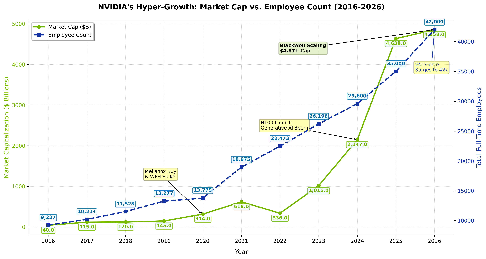

# 🚀 Nvidia Hyper-Growth: Valuation vs. Workforce Size (2016-2026)

<a href="https://github.com/ishandutta2007/Awesome-Awesome-Awesome"></a><a href="https://discord.gg/jc4xtF58Ve"></a><a href="https://github.com/ishandutta2007"></a>

This repository hosts a data visualization analysis exploring **NVIDIA's hyper-growth** over the decade spanning 2016 to 2026. By mapping **NVIDIA's market capitalization** against its **global employee headcount**, this study highlights the unprecedented **workforce scaling leverage** and productivity efficiency achieved during the Generative AI revolution. It details key historical milestones including the Mellanox acquisition (2020), the H100 GPU Generative AI boom (2024), and Blackwell scaling (2026).

## 🔍 Keywords & Topics
`NVIDIA Market Cap` • `Workforce Efficiency` • `NVIDIA Headcount History` • `AI Hardware Surge` • `Mellanox Acquisition` • `Blackwell Architecture` • `Corporate Productivity Analysis`

## 💡 Key Insights

The visualization contrasts the incredible leverage and efficiency gains achieved by NVIDIA during the Generative AI surge:

*   📈 **Valuation Expansion**: Market capitalization went up by **121.5x** (surging from \$40.0 Billion to \$4.858 Trillion).
*   👥 **Workforce Scaling**: Employee headcount went up by only **4.6x** (growing from 9,227 to 42,000 full-time employees).
*   💰 **Valuation per Employee**: The market cap value generated per employee increased by **26.7x**, jumping from **\$4.3 Million** in 2016 to **\$115.7 Million** in 2026.

---

## 📊 Visualization



---

## ⚙️ How to Run the Analysis

### 📦 Prerequisites

Ensure you have Python and `matplotlib` installed:

```bash
pip install matplotlib
```

### 🏃 Execution

Run the script to generate and save the plot:

```bash
python nvidia_marketcap_vs_headcount.py
```

The output plot will be saved in `assets/nvidia_growth.png`.
